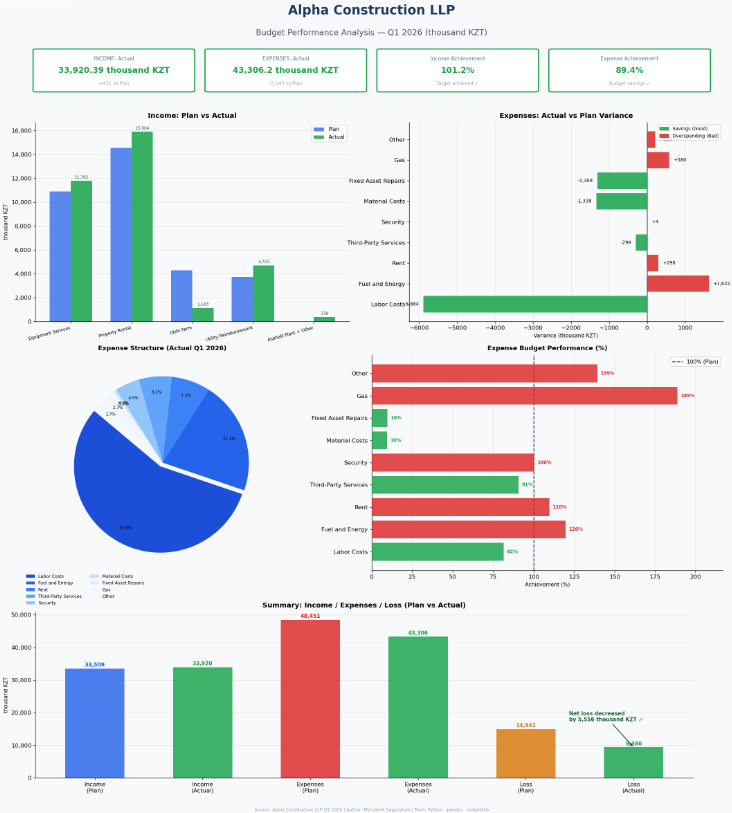

# Budget Execution Analysis — Q1 2026

**Project:** Industrial Internship 1 | SDU University | June 2026  
**Author:** Myrzabek Sagynzhan  
**Tools:** Python · pandas · matplotlib · numpy

> Company name anonymized. Source data file not included due to confidentiality.

---

## Project Goal

Analyze the Q1 2026 budget execution report of a construction company:
- Compare **planned vs actual** revenues and expenses
- Calculate **variance** and **performance %** for each line item
- Identify **over-budget** and **under-budget** categories
- Visualize key financial metrics in a 5-panel dashboard

---

## Files

| File | Description |
|---|---|
| `Budget_Execution_Analysis_Q1_2026.ipynb` | Main analysis notebook |
| `budget_analysis_Q1_2026.png` | 5-panel dashboard |

---

## Dashboard Preview



---

## Key Findings

| Metric | Plan | Actual | Variance |
|---|---|---|---|
| Total Revenue | 33,509 K₸ | 33,920 K₸ | **+411 K₸ (+1.2%)** |
| Total Expenses | 48,451 K₸ | 43,306 K₸ | **−5,145 K₸ (−10.6%)** |
| Net Loss | −14,942 K₸ | −9,386 K₸ | **improved by 5,556 K₸** |

**Highlights:**
- Revenue plan exceeded by 1.2% 
- Significant expense savings of 10.6% 
- Labour costs under budget by 18.5% 
- Gas costs overrun by 89% 
- Fuel & Energy overrun by 20% 

---

## How to Run

```bash
pip install pandas matplotlib numpy xlrd openpyxl
jupyter notebook Budget_Execution_Analysis_Q1_2026.ipynb
```

Place your source `.xlsx` file in the same folder and update `FILE_PATH` in Cell 1.

---

## Tools Used

`Python 3` · `pandas` · `matplotlib` · `numpy` · `Jupyter Notebook`
